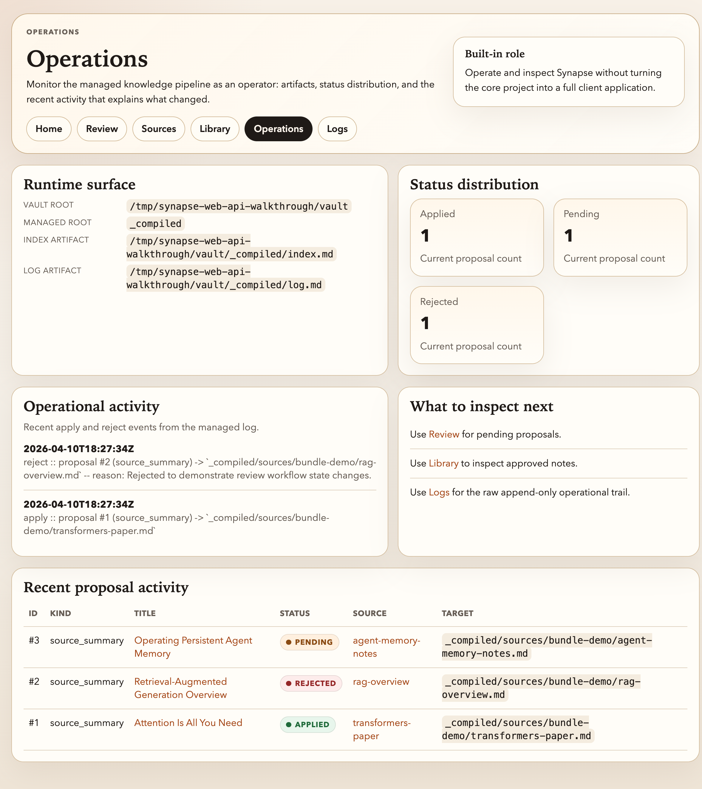
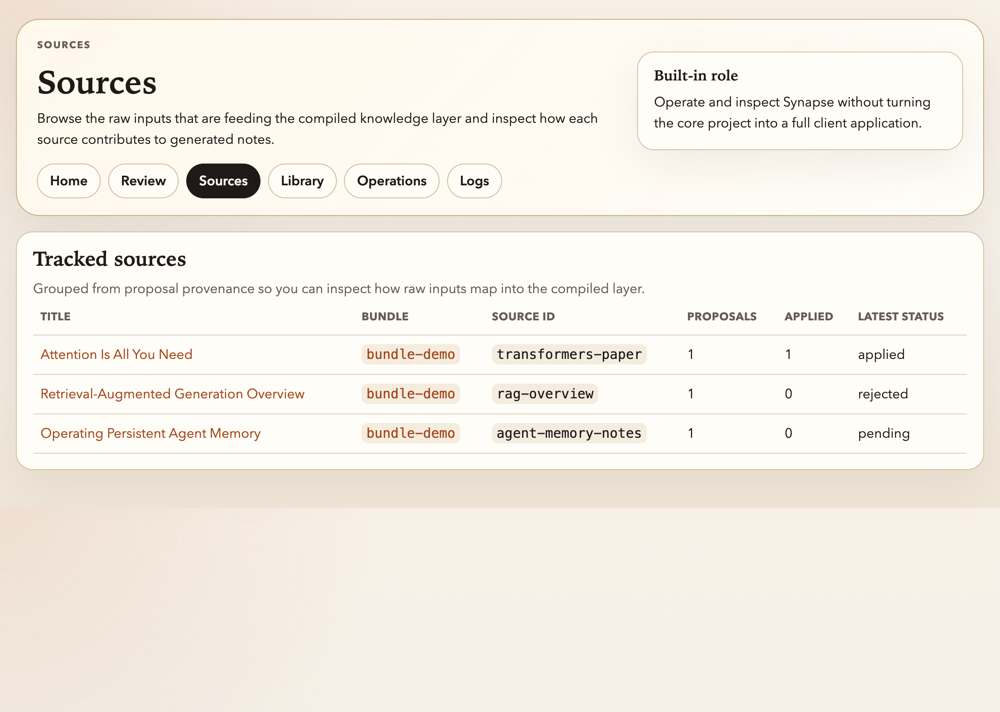
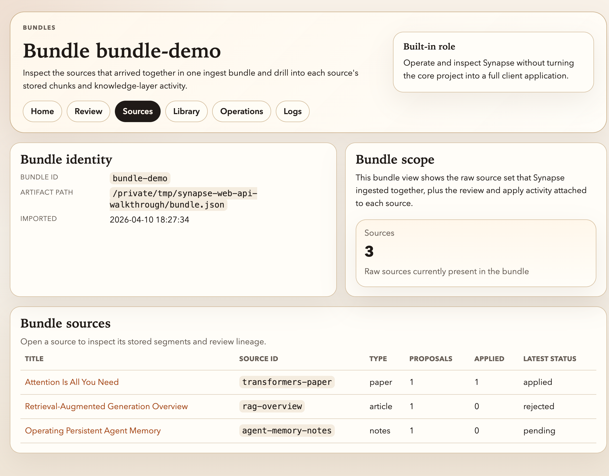
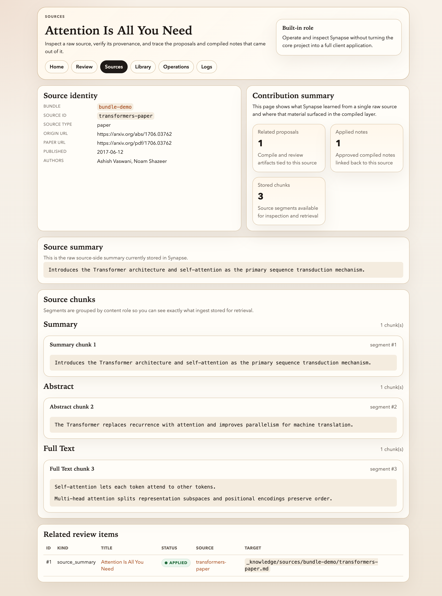
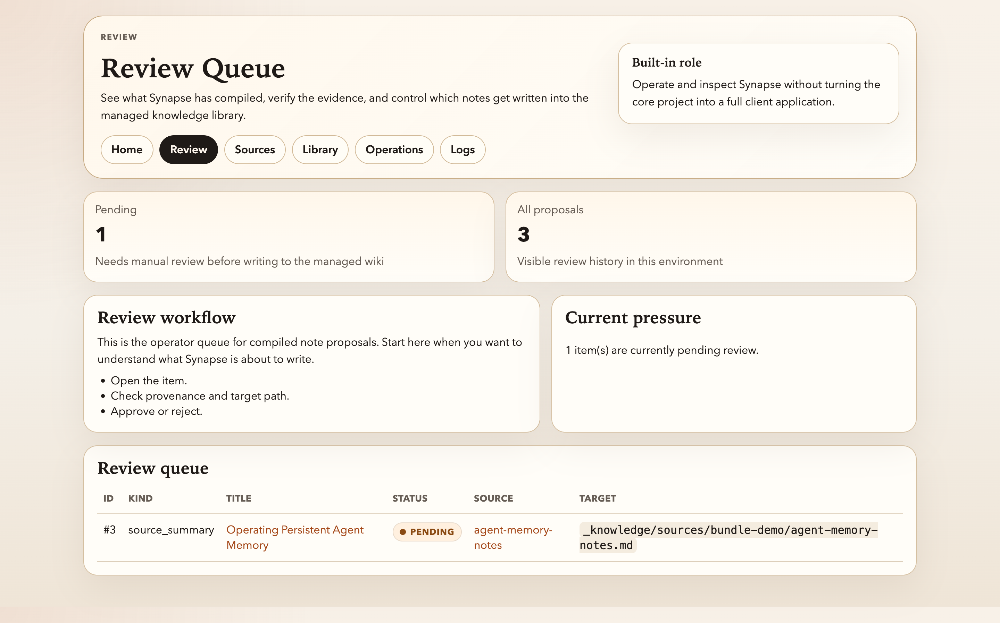
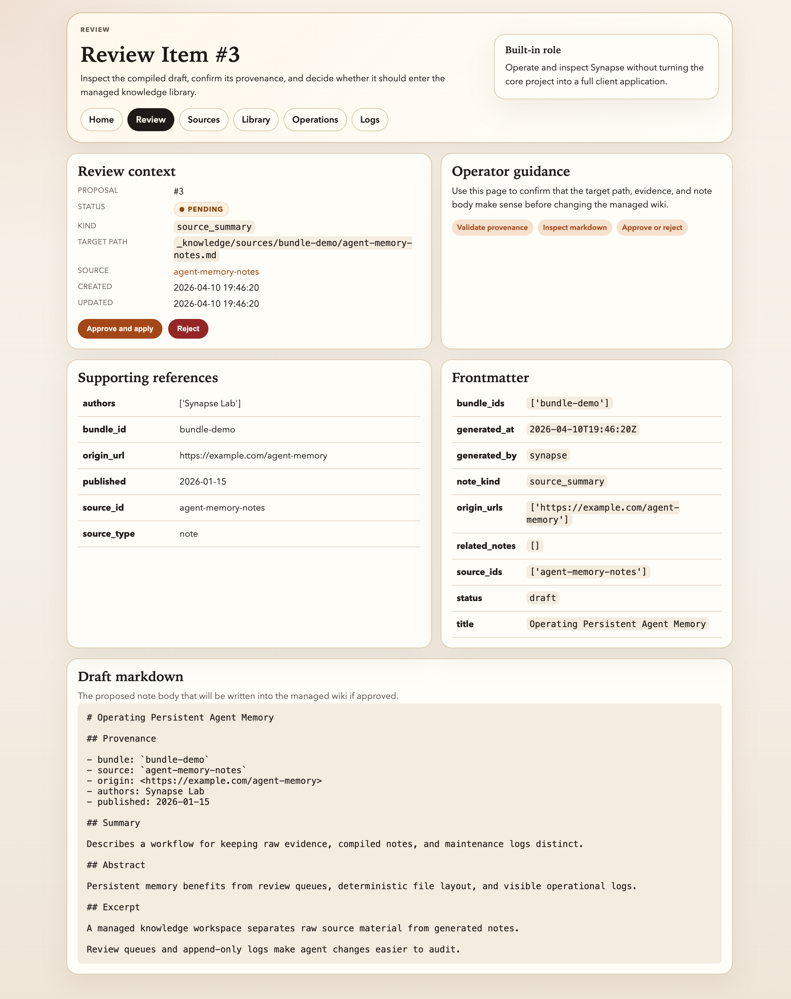
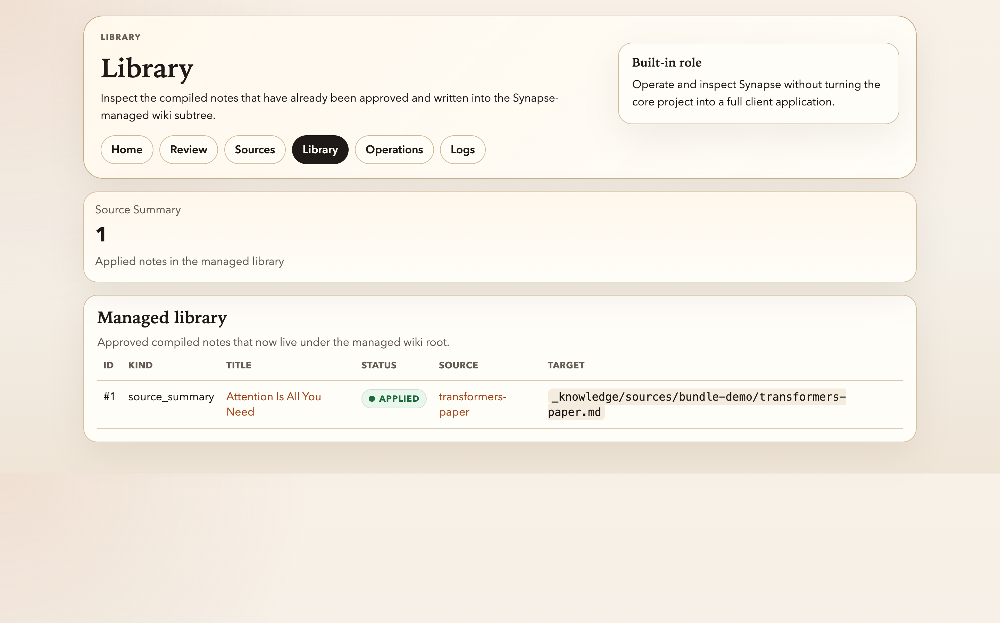
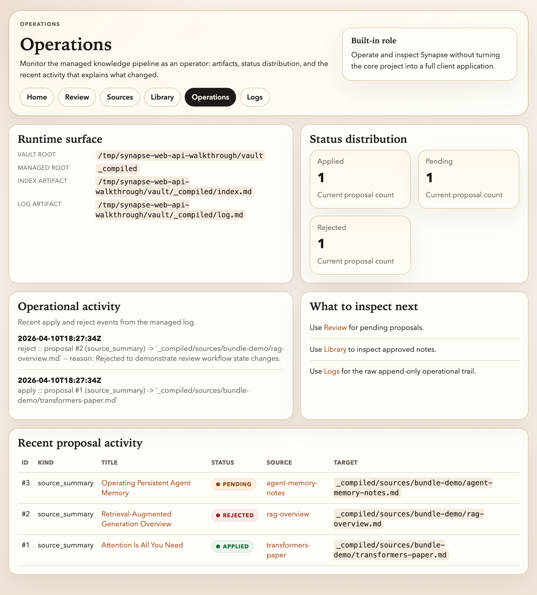
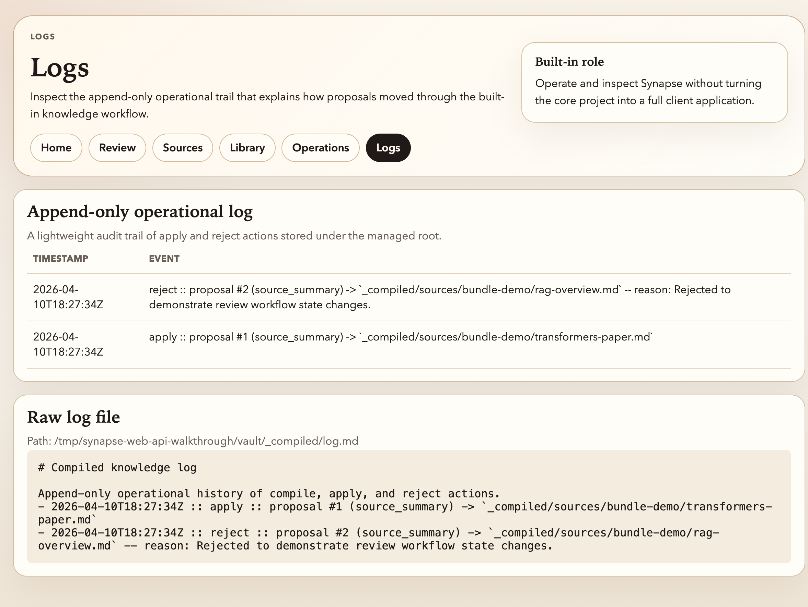

# Knowledge Admin Guide

This guide walks through the built-in knowledge admin UI in Synapse.

The admin UI is an operator console, not a general editor. Its purpose is to help you:
- understand what Synapse ingested
- inspect source chunks and provenance
- review compiled-note proposals
- verify what has been applied
- monitor the operational trail

The main operator workflow is:

`Home -> Sources -> Bundle -> Source -> Review -> Library -> Operations -> Logs`

## 1. Home

Use `Home` to understand the current state of the compiled knowledge layer at a glance.

- `Pending review` tells you how many proposals still need operator action
- `Applied notes` shows how much compiled knowledge is already live
- `Rejected` and `Conflicts` help you spot review pressure and failure states
- `Recent activity` gives you a fast summary of what changed recently

## 2. Sources

Use `Sources` when you want to start from raw inputs instead of generated artifacts.

- each row is a source known to Synapse
- the `Bundle` column shows which ingest bundle it came from
- proposal and apply counts show how much compiled activity came out of that source

This is usually the best place to start when debugging or explaining the evidence flow.

## 3. Bundle Detail

Click a bundle to see the set of sources that were ingested together.

- this view helps you understand the scope of one ingest event
- it shows which sources produced proposals
- it gives you a clean handoff into source-level inspection

## 4. Source Detail And Chunks

This is the most important evidence-inspection screen.

- the top section shows source metadata and contribution summary
- `Source summary` shows the normalized source-side summary stored in Synapse
- `Source chunks` shows the stored segments grouped by `summary`, `abstract`, and `full_text`
- `Related review items` shows which compiled-note proposals came from this source

If you want to know what Synapse actually indexed for retrieval, this is the screen to use.

## 5. Review Queue

Use `Review` as the operator inbox.

- pending proposals are the items that may enter the managed wiki
- this view is where you decide what deserves approval
- each row links into a detailed proposal inspection page

## 6. Review Item

The proposal detail screen is where you make a decision.

- `Review context` shows status, note kind, target path, and linked source
- `Supporting references` shows the stored provenance fields
- `Frontmatter` shows what metadata will be written into the compiled note
- `Draft markdown` shows the actual note body that will be written on apply

The normal decision flow is:
1. confirm the source and target path
2. inspect provenance and frontmatter
3. read the draft markdown
4. approve or reject

## 7. Library

Use `Library` to inspect compiled notes that have already been approved and written into the managed subtree.

- only applied notes appear here
- this is the best high-level view of the managed wiki surface
- it confirms what is currently live after review

## 8. Operations

Use `Operations` for administrative monitoring.

- `Runtime surface` shows vault and managed artifact paths
- `Status distribution` summarizes proposal state counts
- `Operational activity` summarizes recent log events
- `Recent proposal activity` helps correlate state changes with concrete proposals

This is the best screen for answering: “what changed, and where should I look next?”

## 9. Logs

Use `Logs` when you need the append-only operational trail directly.

- it shows parsed log entries for quick reading
- it also shows the raw `_knowledge/log.md` contents
- this is the lowest-level built-in audit view for knowledge review activity

## Practical Reading Order

For day-to-day use:

1. Start on `Home` to assess pressure and recent activity.
2. Open `Review` if there are pending proposals.
3. Jump to the linked `Source` page if you need to inspect evidence and chunks.
4. Approve or reject from the `Review Item` page.
5. Confirm the result in `Library`.
6. Use `Operations` and `Logs` if you need to verify what happened afterward.

For debugging ingest/retrieval issues:

1. Start on `Sources`.
2. Open the relevant `Bundle`.
3. Open the `Source` page and inspect `Source chunks`.
4. Then move to `Review`, `Operations`, and `Logs` as needed.

## Agent Access via MCP

Every operator capability above is also reachable from an MCP client, so the
same review/apply workflow can be driven by an agent. The tools share the
`service_api` layer with the HTTP routes and the admin UI — there is no
parallel implementation to drift out of sync.

| Admin UI surface | MCP tool |
| --- | --- |
| (ingest prepared bundle) | `synapse_ingest_bundle` |
| Home | `synapse_knowledge_overview` |
| Bundle detail | `synapse_knowledge_bundle_detail` |
| Source detail and chunks | `synapse_knowledge_source_detail` |
| (compile a bundle) | `synapse_knowledge_compile_bundle` |
| Review queue | `synapse_knowledge_list_proposals` |
| Review item | `synapse_knowledge_get_proposal` |
| Apply button | `synapse_knowledge_apply_proposal` |
| Reject button | `synapse_knowledge_reject_proposal` |

All knowledge tools honor the `knowledge.enabled` feature gate. If the flag is
off, each tool raises a structured bad-request error pointing at the setting,
and no managed files are written — the same behavior as the HTTP API. The
tools reuse the existing path-normalization logic, so agents can pass plain
string `config_path` / `vault_root` / `db_path` overrides without encoding them
into collapsed argument blobs.
